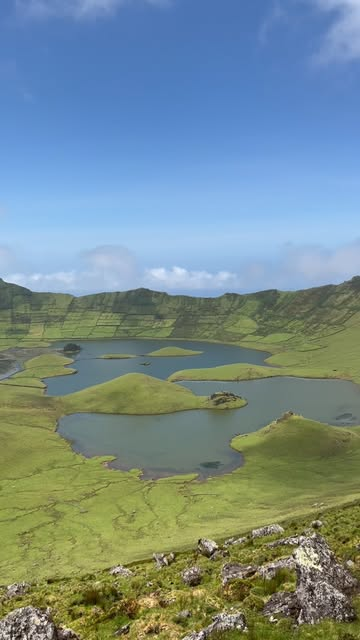
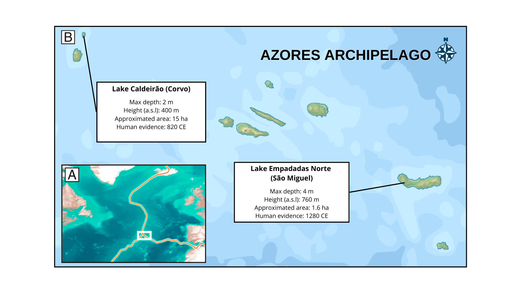

# Outline

::::: columns
::: {.column width="65%"}
1.  Introduction
2.  The dataset for today
3.  Defining the trajectories
4.  Calculation of trajectory metrics
5.  Comparing trajectories
6.  Hearing the trajectories
7.  Use your own data
:::

::: {.column width="35%"}

:::
:::::

# 1. Introduction {background-color="pink"}

## Elementome Trajectory Analysis

. . .

**What is Elementome Trajectory Analysis?**

Elementome Trajectory analysis is the use of Ecological Trajectory Analysis in a multivariate spece defined by the elemental composition of an item through time

. . .

**What is an elementome?**

-   In 2019, Peñuelas et al., defined elementome to describe the elemental composition that characterize an organism, linking it to their physiological requirements to carry out its functions

-   The concept has been extended to characterize the change in the elemental composition of ecosystem through time: **ecosystem elementome shifts**

. . .

. . .

**Studying ecosystem elementomes**

-   Today you will use elemental measurements from paleoecological records to reconstruct changes in the ecosystem elementome

-   This data is published in de la [Casa et al. 2025](https://doi.org/10.1016/j.ecolind.2025.113630). Unveiling two millennia of ecosystem changes in the Azores through elementome trajectory analysis

::: footer
1.  Introduction
:::

# 2. The dataset for today {background-color="pink"}

## The dataset

For this exercise we are going to move to the Azores, where we will study sediment cores from two shallow lakes

{fig-align="center"}

::: footer
2.  The data for today
:::

## Loading the data

So lets start with R - Load packages and the database

```{r, echo = TRUE}
library(readr)
library(dplyr)
library(ecotraj)
library(ggplot2)
library(ggrepel)

ETA_azores_example <- read_delim("../exercises/StudentCSVdata/ETA_azores_example.csv",
                                 delim = ";", escape_double = FALSE, trim_ws = TRUE)
```

. . .

And we inspect inspect its structure:

```{r, echo = TRUE}
ETA_azores_example
```


::: footer
2.  The data for today
:::

## What are the variables in the dataset?

The elemental composition (C, N, Ca, Fe, Fe, K, Mn, Si, Ti, Sr, Zr) from chronologically dated sediment samples of the two lakes

. . .

-   C and N are measured with spectrometer, the rest with X-Ray fluorescence.
-   We will transform the data so it is comparable (first root square and then min-max transformation)

::: footer
2.  The data for today
:::

## Data transformation

-   record_ID identifies eack lake
-   TIME_BP is the calibrated age in years before present (cal. years BP)

. . .

```{r, echo = TRUE}
element_list <- c("C","N", "Ca",  "Fe", "K",
                  "Mn",  "S", "Si", "Ti",  "Sr",  "Zr")


azores <- ETA_azores_example %>%
  group_by(record_ID) %>%
  # Apply square root transformation
  mutate(across(all_of(element_list), ~ sqrt(.), .names = "{.col}")) %>%
  # MIn-maz transformation (between 0 and 1)
  mutate(across(all_of(element_list), ~ (. - min(.)) / (max(.) - min(.)), .names = "{.col}")) %>%
  # Remove duplicates
  distinct(TIME_BP, .keep_all = TRUE) %>%
  ungroup()
```

. . .

. . .

::: callout-note
Now all elements are between 0 and 1. Thus, we work with relative quantifications.
:::

::: footer
2.  The data for today
:::

# 3. Defining the trajectories {background-color="pink"}

## Common vs. lake-individual spaces

**We have to choose now**

-   We can define a common multivariate space for the two sites. This is better to make comparisons between sites
-   Generate independent multivariate spaces for each site. This could be useful if the elements available in both sites are very different
-   Here, we will use the first approach :)

::: footer
3.  Defining the trajectory
:::

## What do we need?

To define trajectories you need:

-   **Distance matrix**: defined using the elemental composition of each lake sedimentary record

-   **Sites**: This will define how many independent trajectories are

-   **Surveys**: This is the steps within the trajectories. Here surveys = time measurements

::: footer
3.  Defining the trajectory
:::

## Building the distance matrix

we are going to use use euclidean distances (thus our ordination analysis will be similar to a PCA). This differ depending on the data you are working with, Give it a thought!

. . .

Euclidean distance assumes:

-   No constant-sum constraint (elemental data is often considered compositional)

-   No relative dependence

-   Proper variable scaling

. . .

```{r, echo = TRUE}
azores <- azores[, c("record_ID","TIME_BP",all_of(element_list))]

#this is the distance matrix
distance_azores<-dist(azores[, -c(1:2)]) #eliminate non-element columns
distance_azores <- as.matrix(distance_azores)
```

::: footer
3.  Defining the trajectory
:::

## Defining the site vector

Each of the lakes is considered a site here.

```{r, echo = TRUE}
site_azores <- azores[, 1]
site_azores <- site_azores[[1]] #Make sure it is a vector
```

::: footer
3.  Defining the trajectory
:::

## Defining the survey vector

Time here is years before present. **ecotraj** will understand older ages (bigger numbers) as the most recent. This could be changed adding a minus

```{r, echo = TRUE}
survey_azores <- azores[, 2]

survey_azores <- survey_azores[[1]] #should be a vector
```

::: footer
3.  Defining the trajectory
:::

## Let's create the trajectories:

We call function  `defineTrajectories()` with the three elements:

```{r, echo = TRUE}

traj_azores <- defineTrajectories(distance_azores, site_azores, times = survey_azores)
```

. . .

Let's inspect the trajectory metadata:

```{r, echo = TRUE}
head(traj_azores$metadata, 20)
```


::: footer
3.  Defining the trajectory
:::

## Let's plot the trajectories

```{r, echo = TRUE}

traj_azores <- defineTrajectories(distance_azores, site_azores, times= survey_azores)


trajectoryPCoA(traj_azores , traj.colors = c("yellow", "green"), lwd = 2,
               survey.labels = F)
legend("topright", col=c("yellow", "green"),
       legend=c("Caldeirao", "Empadadas"), bty="n", lty=1, lwd = 2)
```

To better interpret the trajectories, we can plot the position of the elements (weight/loadings) in the multivariate space.

This in not yet possible in **ecotraj**, we will use the `prcomp()` function from **base**

::: footer
3.  Defining the trajectory
:::

## Plotting the elements in the plot

```{r, echo = TRUE}
pca_result <- prcomp(azores[, -c(1:2)], center = TRUE, scale. = FALSE)
pca_scores <- as.data.frame(pca_result$x)
pca_scores$age <- azores$TIME_BP
pca_scores$group <- azores$record_ID
loadings <- as.data.frame(pca_result$rotation)
loadings$element <- rownames(loadings)

arrow_scale <- 3
loadings <- loadings %>%
  mutate(PC1 = PC1 * arrow_scale,
         PC2 = PC2 * arrow_scale)

```

::: footer
3.  Defining the trajectory
:::

## Plotting the elements in the plot

```{r, echo = TRUE}

ggplot() +
  # Trajectory path
  geom_path(data = pca_scores, aes(x = PC1, y = PC2, group = 1, color = group), linewidth = 1, alpha=0.2) +
  # Loadings arrows
  geom_segment(data = loadings,
               aes(x = 0, y = 0, xend = PC1, yend = PC2),
               arrow = arrow(length = unit(0.3, "cm")),
               color = "black", linewidth = 0.3) +
  # Labels for elements
  geom_text_repel(data = loadings,
                  aes(x = PC1, y = PC2, label = element),
                  color = "black", size = 3) +
  # Points
  geom_point(data = pca_scores, aes(x = PC1, y = PC2, color = group), size = 3, alpha=0.2) +

  theme_bw() +
  labs(title = "PCA Trajectory with Element Loadings",
       x = "PC1",
       y = "PC2",
       color = "Age Segment")


```

::: footer
3.  Defining the trajectory
:::

## Plotting the elements in the plot

<!-- ::::: columns -->

<!-- ::: {.column width="50%"} -->

```{r, echo = FALSE, fig.width=8, fig.height=4}
trajectoryPCoA(traj_azores , traj.colors = c("yellow", "green"), lwd = 2,
               survey.labels = F)
legend("topright", col=c("yellow", "green"),
       legend=c("Caldeirao", "Empadadas"), bty="n", lty=1, lwd = 2)
```

<!-- ::: -->

<!-- ::: {.column width="50%"} -->

```{r, echo = FALSE, fig.width=8, fig.height=4}
pca_scores$PC2 <- -pca_scores$PC2
loadingsPC2 <- -loadings$PC2

ggplot() +
  # Trajectory path
  geom_path(data = pca_scores, aes(x = PC1, y = PC2, group = 1, color = group), linewidth = 1, alpha=0.2) +
  # Loadings arrows
  geom_segment(data = loadings,
               aes(x = 0, y = 0, xend = PC1, yend = PC2),
               arrow = arrow(length = unit(0.3, "cm")),
               color = "black", linewidth = 0.3) +
  # Labels for elements
  geom_text_repel(data = loadings,
                  aes(x = PC1, y = PC2, label = element),
                  color = "black", size = 3) +
  # Points
  geom_point(data = pca_scores, aes(x = PC1, y = PC2, color = group), size = 3, alpha=0.2) +

  theme_bw() +
  labs(title = "PCA Trajectory with Element Loadings",
       x = "PC1",
       y = "PC2",
       color = "Age Segment")
```

<!-- ::: -->
<!-- ::::: -->

::: footer
3.  Defining the trajectory
:::

## Plotting sites individually

We can plot each trajectory individually as well using subsetTrajectories

::::: columns
::: column
```{r, echo = TRUE}
traj_caldeirao <- subsetTrajectories(traj_azores, site_selection = "caldeirao")
trajectoryPCoA(traj_caldeirao)

```
:::

::: column
```{r, echo = TRUE}
traj_empadadas <- subsetTrajectories(traj_azores, site_selection = "empadadas")
trajectoryPCoA(traj_empadadas)

```
:::
:::::

::: footer
3.  Defining the trajectory
:::

## Plotting specific moments of time

```{r, echo = TRUE}
traj_azores_ModernEra<- subsetTrajectories(traj_azores,  window_selection = c(0, 500)) # remember the minus

trajectoryPCoA(traj_azores_ModernEra , traj.colors = c("yellow", "green"), lwd = 2,
               survey.labels = F)
legend("topright", col=c("yellow", "green"),
       legend=c("Calderiao", "Empadadas"), bty="n", lty=1, lwd = 2)
```

::: footer
3.  Defining the trajectory
:::

## Plotting smoothed trajectories

```{r, echo = TRUE}
traj_azores_ModernEra_smooth<- smoothTrajectories(traj_azores_ModernEra) 

trajectoryPCoA(traj_azores_ModernEra_smooth , traj.colors = c("yellow", "green"), lwd = 2,
               survey.labels = F)
legend("topright", col=c("yellow", "green"),
       legend=c("Calderiao", "Empadadas"), bty="n", lty=1, lwd = 2)
```

# 4. Calculation of trajectory metrics {background-color="pink"}

## Overall trajectory metrics

The function `trajectoryMetrics()` calculates different metrics for all the trajectory

```{r, echo = TRUE}
metrics_azores_allperiod <- trajectoryMetrics(traj_azores)

metrics_azores_allperiod
```

::: footer
4.  Calculation of trajectory metrics
:::

## Calculating metrics across the trajectory

- We may be interested in how this metric changes through time.

- We need to use moving windows, lets do a 500 years one (for each survey, it generates a moving window and calculate the metrics within)

```{r, echo = TRUE}
metrics_azores<- trajectoryWindowMetrics(traj_azores, 500, type = "times", add = TRUE)

metrics_azores <- metrics_azores%>% mutate(
  meantime = ((t_start + t_end)/2))
```

::: footer
4.  Calculation of trajectory metrics
:::

## Plotting metric trends

Now we have a good quantitative assessment of how trajectories change through time, lets plot one of them (internal variance):

```{r, echo = TRUE}
ggplot(metrics_azores, aes(x = meantime , y = internal_variance, color = trajectory, group = trajectory)) + 
  geom_line(linewidth = 1) + 
  scale_x_reverse() + theme_minimal()
```

::: footer
4.  Calculation of trajectory metrics
:::

## Choosing the right moving windows

Caldeirao record spans 2035 years, while Empadadas only 660. - we should use windows spanning proportional spans, lets say 15%

```{r, echo = TRUE}
metrics_caldeirao<- trajectoryWindowMetrics(traj_caldeirao, 305, type = "times", add = TRUE)
metrics_caldeirao <- metrics_caldeirao%>% mutate(
  meantime = ((t_start + t_end)/2))

metrics_empadadas<- trajectoryWindowMetrics(traj_empadadas, 99, type = "times", add = TRUE)
metrics_empadadas <- metrics_empadadas%>% mutate(
  meantime = ((t_start + t_end)/2))
```

::: footer
4.  Calculation of trajectory metrics
:::

## Adding more layers:

The Azores had been subject to two waves of human arrival (Raposeiro et al., 2021). The arrival of Portuguese around 1450 CE (500 years BP), and potential earlier settlements 600 years before (1100 years BP)

-   [<strong>GREEN</strong>]{style="color: green;"} for prehuman conditions

-   [<strong>BLUE</strong>]{style="color: blue;"} for first settlers

-   [<strong>RED</strong>]{style="color: red;"} for Portuguese colonization

::: footer
4.  Calculation of trajectory metrics
:::

## How to interpret the metrics

{fig-align="center"}

::: footer
4.  Calculation of trajectory metrics
:::

## Internal variance (elemental turnover)

::::: columns
::: column
```{r, echo = TRUE}
ggplot(metrics_caldeirao, aes(x = meantime, y = internal_variance)) +
  geom_line(linewidth = 1) +
  # Green: no humans
  annotate("rect", xmin = 2000, xmax = 1100,
           ymin = -Inf, ymax = Inf, alpha = 0.2, fill = "green") +
  # Blue: first settlers (TIME_BP ~1100)
  annotate("rect", xmin = 1100, xmax = 498,
           ymin = -Inf, ymax = Inf, alpha = 0.2, fill = "blue") +
  # Red: European (TIME_BP ~450)
  annotate("rect", xmin = 498, xmax = -50,
           ymin = -Inf, ymax = Inf, alpha = 0.2, fill = "red") +
  labs(x = "Time (years BP)",
       y = "Internal Variance",
       color = "Trajectory") +
  theme_minimal() +
  scale_x_reverse()

```
:::

::: column
```{r, echo = TRUE}
ggplot(metrics_empadadas, aes(x = meantime, y = internal_variance)) +
  geom_line(linewidth = 1) +
  # Green: no humans
  annotate("rect", xmin = 600, xmax = 518,
           ymin = -Inf, ymax = Inf, alpha = 0.2, fill = "blue") +
  # Red: European (TIME_BP ~450)
  annotate("rect", xmin = 518, xmax = -50,
           ymin = -Inf, ymax = Inf, alpha = 0.2, fill = "red") +
  labs(x = "Time (years BP)",
       y = "Internal Variance",
       color = "Trajectory") +
  theme_minimal() +
  scale_x_reverse()
```
:::
:::::

::: footer
4.  Calculation of trajectory metrics
:::

## Directionality

::::: columns
::: column
```{r, echo = TRUE}
ggplot(metrics_caldeirao, aes(x = meantime, y = directionality)) +
  geom_line(linewidth = 1) +
  # Green: no humans
  annotate("rect", xmin = 2000, xmax = 1100,
           ymin = -Inf, ymax = Inf, alpha = 0.2, fill = "green") +
  # Blue: first settlers (TIME_BP ~1100)
  annotate("rect", xmin = 1100, xmax = 498,
           ymin = -Inf, ymax = Inf, alpha = 0.2, fill = "blue") +
  # Red: European (TIME_BP ~450)
  annotate("rect", xmin = 498, xmax = -50,
           ymin = -Inf, ymax = Inf, alpha = 0.2, fill = "red") +
  labs(x = "Time (years BP)",
       y = "Directionality",
       color = "Trajectory") +
  theme_minimal() +
  scale_x_reverse()

```
:::

::: column
```{r, echo = TRUE}
ggplot(metrics_empadadas, aes(x = meantime, y = directionality)) +
  geom_line(linewidth = 1) +
  # Green: no humans
  annotate("rect", xmin = 600, xmax = 518,
           ymin = -Inf, ymax = Inf, alpha = 0.2, fill = "blue") +
  # Red: European (TIME_BP ~450)
  annotate("rect", xmin = 518, xmax = -50,
           ymin = -Inf, ymax = Inf, alpha = 0.2, fill = "red") +
  labs(x = "Time (years BP)",
       y = "Directionality",
       color = "Trajectory") +
  theme_minimal() +
  scale_x_reverse()
```
:::
:::::

::: footer
4.  Calculation of trajectory metrics
:::

## Speed

::::: columns
::: column
```{r, echo = TRUE}
ggplot(metrics_caldeirao, aes(x = meantime, y = mean_speed)) +
  geom_line(linewidth = 1) +
  # Green: no humans
  annotate("rect", xmin = 2000, xmax = 1100,
           ymin = -Inf, ymax = Inf, alpha = 0.2, fill = "green") +
  # Blue: first settlers (TIME_BP ~1100)
  annotate("rect", xmin = 1100, xmax = 498,
           ymin = -Inf, ymax = Inf, alpha = 0.2, fill = "blue") +
  # Red: European (TIME_BP ~450)
  annotate("rect", xmin = 498, xmax = -50,
           ymin = -Inf, ymax = Inf, alpha = 0.2, fill = "red") +
  labs(x = "Time (years BP)",
       y = "Speed",
       color = "Trajectory") +
  theme_minimal() +
  scale_x_reverse()

```
:::

::: column
```{r, echo = TRUE}
ggplot(metrics_empadadas, aes(x = meantime, y = mean_speed)) +
  geom_line(linewidth = 1) +
  # Green: no humans
  annotate("rect", xmin = 600, xmax = 518,
           ymin = -Inf, ymax = Inf, alpha = 0.2, fill = "blue") +
  # Red: European (TIME_BP ~450)
  annotate("rect", xmin = 518, xmax = -50,
           ymin = -Inf, ymax = Inf, alpha = 0.2, fill = "red") +
  labs(x = "Time (years BP)",
       y = "Speed",
       color = "Trajectory") +
  theme_minimal() +
  scale_x_reverse()
```
:::
:::::

::: footer
4.  Calculation of trajectory metrics
:::

# 5. Comparing trajectories {background-color="pink"}

## Estimating convergence/divergence of trajectories

Now we are going to calculate metrics of the divergence/convergence of the trajectories. For that we are going to subset our trajectories for the period that we have data in both, the modern era that we subsetted before

. . .

. . .

We are going to use the Relative Trajectory Movement Assessment (RTMA) (Djeghri et al., 2026. Ecological Monographs) using the **ecotraj** trajectoryRMA
. . .

. . .


```{r, eval = FALSE, echo = TRUE}

trajectoryRMA(traj_azores_ModernEra)
```

It gives error becase the number of surveys does not match

::: footer
5.  Comparing trajectories
:::

## Transforming trajectories

We are going to interpolate the trajectories so they have the same number of surveys

```{r, echo = TRUE}

traj_azores_mod_inter <- interpolateTrajectories(traj_azores_ModernEra, times = c(50, 100, 150, 200, 250, 300, 350, 400, 450))

trajectoryPCoA(traj_azores_mod_inter , traj.colors = c("yellow", "green"), lwd = 2, survey.labels = F)
legend("topright", col=c("yellow", "green"), legend=c("Caldeirao", "Empadadas"), bty="n", lty=1, lwd = 2)

```

::: footer
5.  Comparing trajectories
:::

## RMA analysis


```{r, echo = TRUE}

trajRMA<- trajectoryRMA(traj_azores_mod_inter)

trajRMA
```


```{r, echo = TRUE}

trajectoryRMAPlot(trajRMA)
```


::: footer
5.  Comparing trajectories
:::

# 6. Hearing the trajectories {background-color="pink"}


We hope that you have now a better understanding of Ecological Trajectory Analysis and motivation to use it as an analytically tool.


